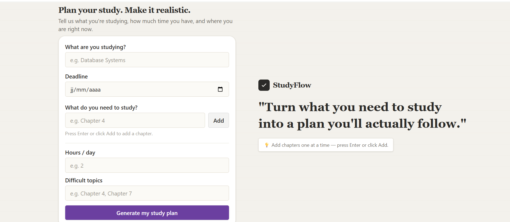
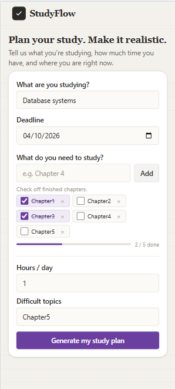
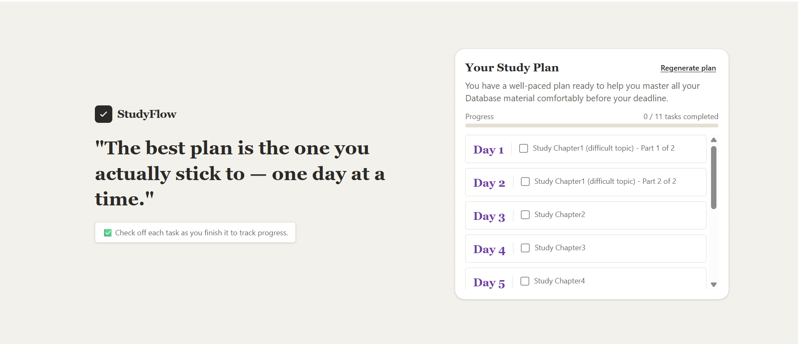
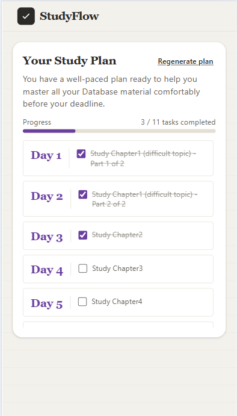
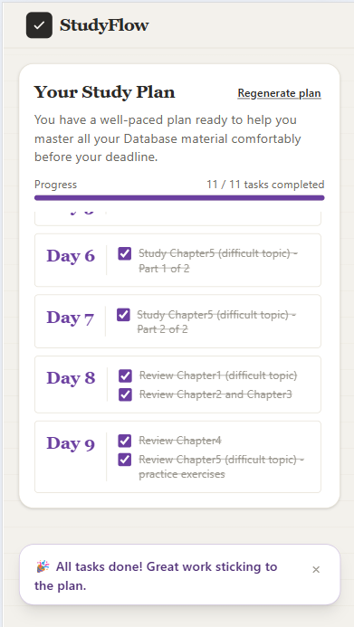
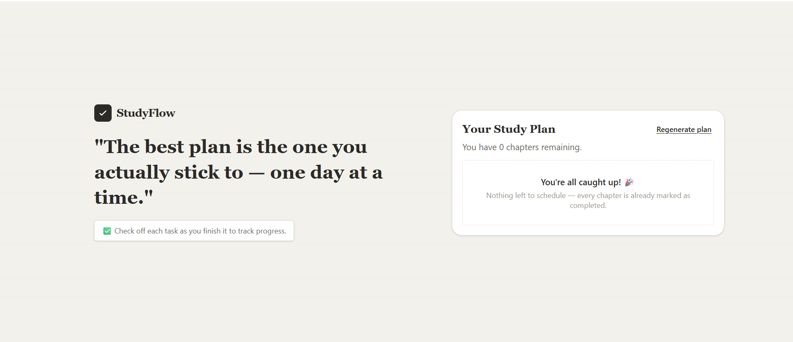

# 🌱 StudyFlow

A small study-planning app that turns your study constraints — subject, deadline, available hours, and difficult topics — into a realistic, day-by-day study plan.

StudyFlow combines a React frontend with an Express backend and Google's Gemini API to generate structured study plans based on the user's actual time and workload.

## Features

- **Study form** — enter your subject, deadline, chapters/material, hours available per day, completed chapters, and difficult topics.
- **AI study-plan generation** — the backend sends your study data to Google's Gemini API, which returns a day-by-day plan that:
  - paces itself across the actual number of days until your deadline
  - sizes each day's workload based on your available hours
  - gives difficult topics extra, dedicated review sessions
  - splits large chapters across multiple days when needed
    -- **AI + local fallback** — the backend validates the AI response and falls back to a local planning algorithm if the AI request fails or returns an invalid response.
- **Progress tracking** — check off tasks as you complete them, with a live progress bar and a completion message when everything's done.
- **Two-screen flow** — a clean form screen, then a dedicated plan screen with a "Regenerate plan" option to go back and adjust your inputs.

## Tech stack

**Frontend**

- React + TypeScript
- Vite
- Tailwind CSS

**Backend**

- Node.js
- TypeScript
- Express
- Google Gemini API (`@google/genai`) for plan generation

## Project structure

```
studyflow/
├── backend/
│   ├── src/
│   │   ├── server.ts          # Express server + AI integration
│   │   └── studyPlanner.ts    # Local fallback plan generator
│   ├── .env                   # GEMINI_API_KEY (not committed)
│   └── package.json
│
├── src/
│   ├── components/
│   │   ├── Header.tsx
│   │   ├── StudyForm.tsx
│   │   └── StudyPlan.tsx
│   ├── types/
│   │   └── Study.ts            # StudyFormData interface
│   ├── App.tsx
│   ├── index.css
│   └── main.tsx
│
├── public/
├── index.html
├── package.json
└── vite.config.ts
```

## Setup

### 1. Clone the repo

```bash
git clone <your-repo-url>
cd studyflow
```

### 2. Install dependencies

Frontend (from the project root):

```bash
npm install
```

Backend:

```bash
cd backend
npm install
```

### 3. Configure a Gemini API key

1. Go to [aistudio.google.com](https://aistudio.google.com)
2. Sign in with a Google account
3. Click **Get API key** → **Create API key**
4. Copy the key

### 4. Set up environment variables

In `backend/`, create a file named `.env`:

```
GEMINI_API_KEY=your-api-key-here
```

### 5. Run the app

You need both servers running at the same time, in two separate terminals.

**Terminal 1 — backend:**

```bash
cd backend
npm run dev
```

You should see `Server running on http://localhost:5000`.

**Terminal 2 — frontend:**

```bash
npm run dev
```

Open the URL Vite prints (usually `http://localhost:5173`).

## How it works

```
User fills out the form
        ↓
StudyFormData sent to the backend
        ↓
Backend prompts Gemini for a structured JSON plan
        ↓
Response is validated (shape-checked) before use
        ↓
    succeeds ──► AI-generated plan
    fails    ──► local fallback plan (generateStudyPlan)
        ↓
Plan rendered on the Study Plan screen
        ↓
User checks off tasks as they complete them
```

## Known limitations

- **No persistence** — refreshing the page loses your current plan and checked-off progress. There's no database or backend storage yet.
- **No authentication or accounts** — this is a single-session, local-use app.
- **Local development only** — not yet deployed; both servers must be run locally.
- **AI output isn't guaranteed** — the backend validates the shape of the AI's response and falls back to a simpler local plan if anything goes wrong (bad response, network issue, rate limit), so plan quality can vary between AI-generated and fallback plans.

## Possible future improvements

- Persist plans and progress (localStorage or a real backend database)
- Deploy the frontend and backend so it's usable outside of local development
- Allow editing a generated plan directly (reorder tasks, add/remove days)
- Show which plan source was used (AI vs. fallback) in the UI

## Screenshots

Screenshots live in the `screenshots/` folder at the project root.

**Form**

Desktop (wide screen — form + pull-quote side by side):


Mobile:


**Study plan**

Desktop (quote/logo + plan side by side):


Mobile:


**Extras**

All tasks completed:


Empty state (everything already marked as completed):

